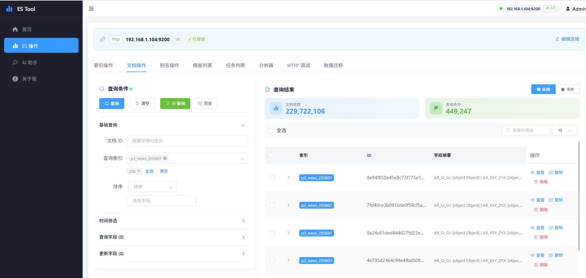

# ES Tool 🛠️ — Elasticsearch GUI for ES 7/8/9 (Multi-Version Visual Management Tool)

English | [中文](./README.md)

> An open-source **Elasticsearch visualization and management platform** that handles **ES 7.x / 8.x / 9.x** clusters from a single UI: index, document, alias, template, analyzer management, HTTP debugging, cross-cluster data migration — with a built-in **AI assistant** that turns natural language into DSL. A lightweight alternative to Kibana / Cerebro / elasticsearch-head.

**Keywords**: Elasticsearch GUI · ES visualization tool · Elasticsearch client · ES 7/8/9 multi-version management · Elasticsearch admin tool · DSL debugging · data migration · Spring Boot + Vue

## ✨ Highlights

- 🔄 **Triple-version compatibility** — One UI for ES 7.x / 8.x / 9.x via **Factory + Strategy + Builder** patterns
- 🤖 **AI assistant** — NL → DSL, streaming chat (SSE), knowledge base, similar-query suggestions
- 🌐 **Multi-cluster management** — One config for dev / staging / prod
- 🚀 **HTTP passthrough mode** — Use new ES features before SDKs catch up
- 🚚 **Data migration** — Cross-cluster, cross-index data transfer
- 🎓 **Beginner-friendly** — Real-world example of design patterns + multi-SDK compatibility in Spring Boot

## 📦 Feature Matrix

| Module | Capabilities |
| --- | --- |
| Index management | Create / delete / view mapping / bulk ops |
| Document ops | CRUD, bulk import, conditional search |
| Alias management | Bind, swap, atomic operations |
| Template management | Index Template / Component Template |
| Analyzer testing | Real-time analyzer comparison |
| HTTP debugging | Native cURL-style requests, bypasses SDK limits |
| Data migration | Cross-cluster / cross-index data transfer |
| AI assistant | NL → DSL, streaming chat, knowledge base, similar queries |
| Task management | Async task tracking |

## 🏗️ Architecture

```
backend/
├── es-tool-common/   # Common: config, utils, domain models
├── es-tool-start/    # Entry: Controllers, Service
├── es-tool-7/        # ES 7.x strategy impls
├── es-tool-8/        # ES 8.x strategy impls
└── es-tool-9/        # ES 9.x strategy impls
```

**Core design patterns:**

1. **Strategy** — Every ES op (index, doc, alias, ...) implements `ElasticsearchOperationStrategy`
2. **Factory** — Picks the right strategy by `version + opType`
3. **Version isolation** — Each ES version's client config and impl live in their own module

> Adding a new ES version? Create one `es-tool-X` module + one factory registration line. Done.

## 🚀 Quick Start

### Prerequisites

| | Version |
| --- | --- |
| JDK | 1.8+ |
| Node.js | 16+ |
| Maven | 3.6+ |

### Backend

```bash
cd backend
mvn clean install
cd es-tool-start
mvn spring-boot:run   # http://localhost:8089
```

### Frontend

```bash
cd web
npm install
npm run serve   # http://localhost:8080
```

### Cluster config

Edit `backend/data/esConnectParam.json`:

```json
[
  {
    "scheme": "http",
    "hostName": "127.0.0.1",
    "port": 9200,
    "userName": "elastic",
    "password": "your-password",
    "version": "8"
  }
]
```

`version`: `"7"` / `"8"` / `"9"`.

## 📸 Screenshots

> Main menu
>
> 

## 🐳 Docker

```bash
docker-compose up -d
```

## 📚 Who is this for?

- **DevOps** — Day-to-day ES cluster ops, cross-version maintenance
- **Developers** — Debugging DSL, bulk data ops, analyzer validation
- **Learners** — Want a real-world Spring Boot project using design patterns + multi-SDK compat

## 🤝 Contributing

Issues / PRs welcome. New ES versions, new strategy ops, bug fixes — all appreciated.

## 📜 License

MIT

---

> Author: 神的孩子都在歌唱 · Blog: https://blog.csdn.net/weixin_46654114
