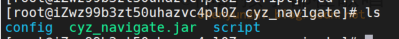

前言： 写一个es工具


## 一. 项目介绍

方便可视化的操作es，创建删除索引，查询文档等等。  本使用了工厂模式+策略模式+建造者等多种模式，适合新手拿来学习

该项目是前后端分离项目:  https://github.com/Rodma1/esTool

## 二. 使用技术

后端： springboot + mybatis-plus  

前端： vue + element

> element: https://element.eleme.cn/#/zh-CN/component/installation
>
> css:  https://www.runoob.com/css/css-examples.html

## 三. 安装部署

### 3.1 环境


| 环境            | 版本           |
| --------------- | -------------- |
| 一台linux服务器 | centos7        |
| java            | 1.8            |
| vue             | @vue/cli 5.0.8 |
| node            | v16.14.0       |
| npm             | 8.3.1          |

### 3.2 代码打包

#### 3.2.1 后端代码打包

拉取最新代码，然后使用idea打开项目，在配置文件里面修改你的es链接路径，这样子就可以从这个配置文件里面读取账号密码


文件格式如下

```json
[
  {

    "scheme": "http",
    "hostName": "192.168.248.128",
    "userName": "elastic",
    "password": "chenyunzhi123",
    "port": "9200"
  },
  {

    "scheme": "http",
    "hostName": "192.168.248.129",
    "userName": "elastic",
    "password": "chenyunzhi123",
    "port": "9200"
  }
]
```

使用以下命令打包jar包

```shell
mvn clean  install
```

可以使用命令   **java -jar target/文件名.jar**  测试运行

#### 3.2.2 前端代码打包

进入到下载好的前端目录下，命令行运行

安装依赖
`npm install`

打包  `npm run build`

运行： `npm run serve`

然后就能打包出一个dist目录，这就是前端的可执行文件了


### 3.3 项目部署linux服务器

以下是我部署的方法，大家可以当做参考

#### 3.3.1 后端

将jar包上传到目录**/study/project/navigate/cyz_navigate**，然后在创建一个config目录存放配置文件**application.yml**，这样子我们的启动的时候可以指定配置文件允行，方便修改配置。


然后在 `/etc/systemd/system`目录下建立一个 `cyz_navigate.service` 在里面配置如下信息,修改以下你的jar包路径就可以

```shell
[Unit]
Description=navication
After=network.target

[Service]
User=root
ExecStart=/usr/bin/java  -Dfile.encoding=UTF-8 -Xms256m -Xmx512m -jar   -Dspring.config.location=/study/project/navigate/cyz_navigate/config/application.yml /study/project/navigate/cyz_navigate/cyz_navigate.jar
SuccessExitStatus=143
Restart=always

[Install]
WantedBy=multi-user.target
```

配置好了后就可以通过以下方式启动和关闭服务了

```shell
systemctl start cyz_navigate.service
systemctl restart cyz_navigate.service
systemctl status cyz_navigate.service
```

你可以专门去写个shell脚本去执行


以下是我的目录



#### 3.4.2 前端

将dist`包放入到服务器的/study/project/navigate/navigate_web/`目录（可以通过压缩成zip包的方式上传，在服务器上解压）


然后需要下载nginx， 可以看我这篇文章（[一文了解和使用nginx（附带图文）](https://blog.csdn.net/weixin_46654114/article/details/134046040?ops_request_misc=%257B%2522request%255Fid%2522%253A%25222E6D96CC-899C-4334-BBE3-AEF3D7F6DC95%2522%252C%2522scm%2522%253A%252220140713.130102334.pc%255Fblog.%2522%257D&request_id=2E6D96CC-899C-4334-BBE3-AEF3D7F6DC95&biz_id=0&utm_medium=distribute.pc_search_result.none-task-blog-2~blog~first_rank_ecpm_v1~rank_v31_ecpm-1-134046040-null-null.nonecase&utm_term=nginx&spm=1018.2226.3001.4450)），然后编辑nginx的配置信息，`/usr/local/nginx/conf/nginx.conf`，参考我的如下配置

``` shell
server {
        listen 80;
        server_name localhost;

        location / {
            root /study/project/navigate/dist;
            index index.html index.htm;
        }

        location /api/ {
            proxy_pass http://127.0.0.1:8089/;
            proxy_set_header Host $host;
            proxy_set_header X-Real-IP $remote_addr;
            proxy_set_header X-Forwarded-For $proxy_add_x_forwarded_for;
            proxy_set_header X-Forwarded-Proto $scheme;
        }
    }

```

配置好后重启一下

``` shell
/usr/local/nginx/sbin/nginx -s reload
```


访问： http://localhost/#/menu


## 四. 页面效果


> 作者：神的孩子都在歌唱
>
> 本人博客：https://blog.csdn.net/weixin_46654114
>
> 转载说明：务必注明来源，附带本人博客连接。
