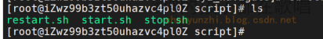

前言： 写一个es工具


## 一. 项目介绍

方便可视化的操作es，创建删除索引，查询文档等等。

该项目是前后端分离项目:  https://github.com/Rodma1/esTool

## 二. 使用技术

后端： springboot + mybatis-plus  

## 三. 安装部署

### 3.1 环境


| 环境            | 版本           |
| --------------- | -------------- |
| 一台linux服务器 | centos7        |
| java            | 1.8            |
| vue             | @vue/cli 5.0.8 |

### 3.2 代码打包

#### 3.2.1 后端代码打包

拉取最新代码，然后使用idea打开项目，在配置文件里面修改你的数据库密码


打成jar，可以使用命令   **java -jar 文件名.jar**  测试运行

### 3.3 项目部署linux服务器

以下是我部署的方法，大家可以当做参考

#### 3.3.1 后端

将jar包上传到目录**/study/project/navigate/cyz_navigate**，然后在创建一个config目录存放配置文件**application.yml**，这样子我们的启动的时候可以指定配置文件允行，方便修改配置。


然后在 `/etc/systemd/system`目录下建立一个 `cyz_navigate.service` 在里面配置如下信息,修改以下你的jar包路径就可以

```shell
[Unit]
Description=navication
After=network.target

[Service]
User=root
ExecStart=/usr/bin/java  -Dfile.encoding=UTF-8 -Xms256m -Xmx512m -jar   -Dspring.config.location=/study/project/navigate/cyz_navigate/config/application.yml /study/project/navigate/cyz_navigate/cyz_navigate.jar
SuccessExitStatus=143
Restart=always

[Install]
WantedBy=multi-user.target
```

配置好了后就可以通过以下方式启动和关闭服务了

```shell
systemctl start cyz_navigate.service
systemctl restart cyz_navigate.service
systemctl status cyz_navigate.service
```

你可以专门去写个shell脚本去执行




以下是我的目录


> 作者：神的孩子都在歌唱
>
> 本人博客：https://blog.csdn.net/weixin_46654114
>
> 转载说明：务必注明来源，附带本人博客连接。
